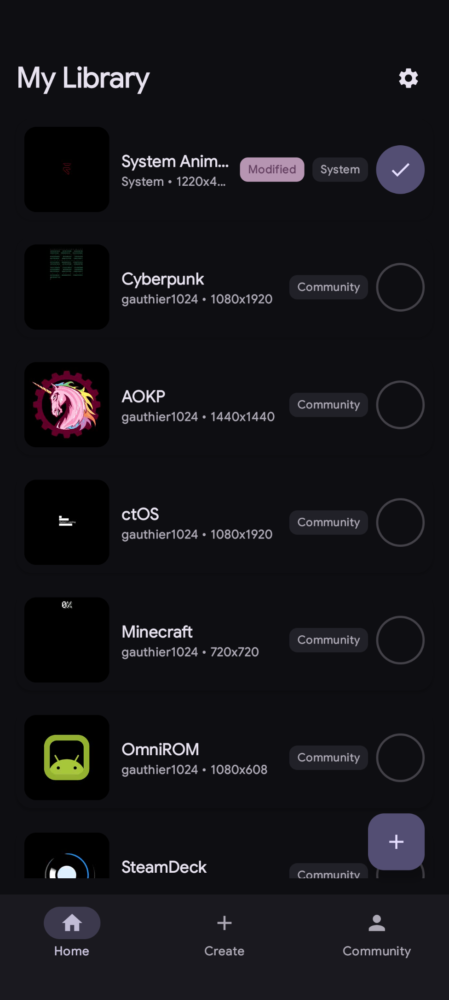
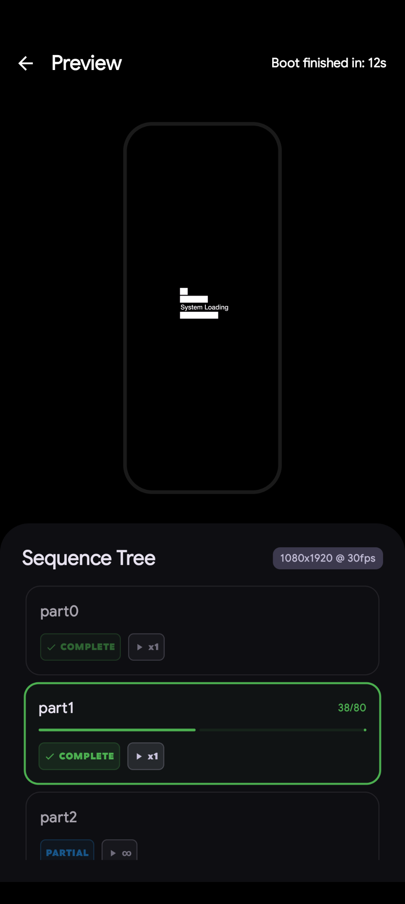
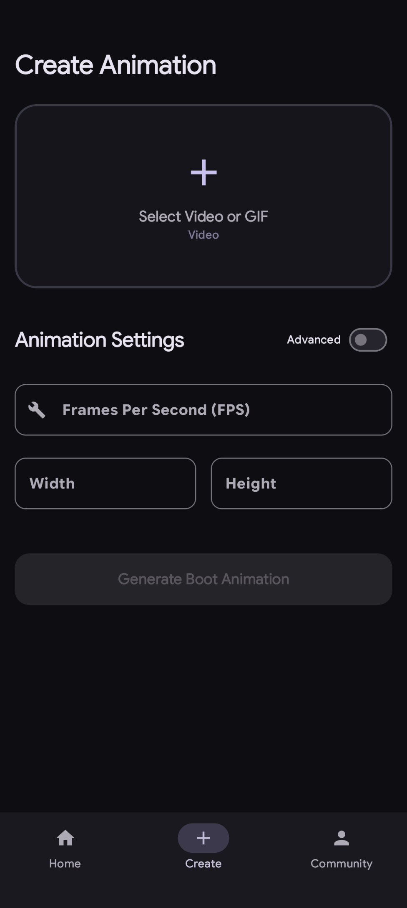
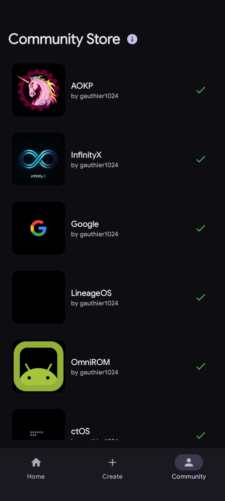

# BootStudio

BootStudio is an Android application for managing and customizing boot animations on rooted devices. It provides a systemless interface to change boot sequences without modifying the system partition directly, using Magisk.

<strong>📷 Click to see screenshots</strong>

  
  
  
  

## Features

- **Animation Management:** List, switch, and delete boot animations easily.
- **Custom Creation:** Package your own animation files into the correct format.
- **Import/Export:** Backup your current animation or import external .zip files.
- **Community Store:** Browse and download animations shared by other users.
- **Systemless Application:** All changes are applied via a Magisk module to keep your device's system partition intact.
- **Live Preview:** View animations within the app before applying them to your device.

## Add your animations to the store

To contribute an animation to the community store, follow these steps:

1. Fork this repository and clone it locally.
2. Open `BootAnimations/bootanimations.json`.
3. Add a new JSON object with your `title` and `creator` name.
4. Create a folder in the `BootAnimations/` directory with the exact same name as your `title`.
5. Place your `bootanimation.zip` inside that folder.
6. Generate a `preview.mp4` and place it in the same folder.
    - You can use the `tools/preview.py` script to create the preview from your zip file.
7. Submit a Pull Request with your changes.

## Requirements

- A rooted Android device.
- Magisk installed.

## How it works

BootStudio uses a Magisk module to overlay your custom animation on top of the system's default files. For a detailed technical breakdown of the module structure and the preview engine, read [HowItWorks.md](HowItWorks.md).

## License

GPL3 License. See the LICENSE file for more details.
